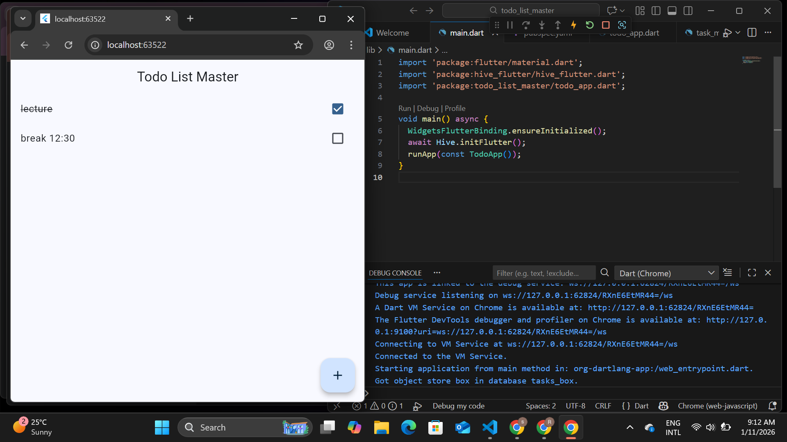

# Todo List Master 📝

A clean, modern Todo application built with Flutter for persistent local storage.

## ✨ Features
* **Persistence:** Tasks are saved locally and persist even after app restart.
* **Material 3:** Modern UI with a teal color scheme.
* **Interactive:** Add tasks via dialog, toggle completion, and long-press to delete.

## 📸 Preview

## 🛠️ How to Run
1. Clone the repo.
2. Run `flutter pub get`.
3. Press `F5` in VS Code.
